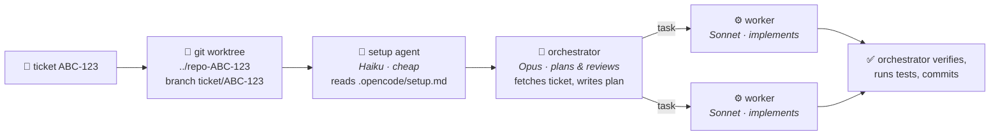

<div align="center">

# 🎫 just-make-it-work

**Throw a ticket id at [opencode](https://opencode.ai). Get a reviewed, tested branch back.**

An Opus orchestrator plans your Linear/Jira ticket and delegates the coding to
Sonnet workers — each ticket in its own git worktree, so you can run five at
once without them stepping on each other.

```sh
curl -fsSL https://raw.githubusercontent.com/MarianBe/just-make-it-work/main/install.sh | bash
```

*One command. No dependencies. Works with GitHub Copilot, Anthropic, or any opencode provider.*

</div>

---

## The workflow

```sh
cd ~/code/my-app
ticket ABC-123
```

```
creating worktree ../my-app-ABC-123 (branch ticket/ABC-123 from main)
bootstrapping worktree via setup agent (.opencode/setup.md)
# → opencode opens, orchestrator fetches ABC-123 from Linear/Jira,
#   shows you its plan, and gets to work
```

Meanwhile, in another terminal:

```sh
ticket XYZ-456        # second ticket, second worktree, zero collisions
```

Come back later with feedback:

```sh
ticket ABC-123 the modal still flickers on iOS
```

Same session, full context, keeps going.

## How it works



Three agents, three jobs, three price points:

| Agent | Model | Job |
|---|---|---|
| 🧠 `orchestrator` | Opus | Fetches the ticket, explores the code, presents a plan, delegates, reviews diffs, runs tests, commits. **Cannot edit files** — write/edit tools are disabled, so implementation is forced through workers. |
| ⚙️ `worker` | Sonnet | Executes one self-contained task at a time: writes code, runs checks, reports back. No scope creep. |
| 🔧 `setup` | Haiku | Bootstraps fresh worktrees from natural-language instructions. Literal executor, never touches app code. |

The orchestrator tries Linear first, falls back to Jira (ticket ids look the
same in both), runs independent tasks in parallel, and iterates on failures
until the test suite is green. It commits on `ticket/ABC-123` and never pushes
unless you ask.

## Install

```sh
curl -fsSL https://raw.githubusercontent.com/MarianBe/just-make-it-work/main/install.sh | bash
```

The installer detects your available models (via `opencode models`) and walks
you through picking one per agent with a built-in arrow-key menu — nested by
provider, suggested defaults preselected, Esc-Esc-Esc accepts everything.
Pure bash. Nothing else to install.

Then authenticate your tracker(s) once (opens a browser):

```sh
opencode mcp auth linear
opencode mcp auth jira
```

What lands where:

| What | Where |
|---|---|
| `orchestrator`, `worker`, `setup` agents | `~/.config/opencode/agents/*.md` |
| `/ticket` command | `~/.config/opencode/commands/ticket.md` |
| `ticket` CLI | `~/.local/bin/ticket` |
| Linear + Jira remote MCP servers | merged into `~/.config/opencode/opencode.json` (existing config untouched) |

## Teach it your repo: `.opencode/setup.md`

A fresh worktree has all tracked files but no `node_modules`, no `.env`, no
generated code. Describe the fix in plain language, committed to your repo:

```markdown
# Worktree setup

- Copy `.env` and `.env.local` from the main checkout (they're gitignored).
- Run `pnpm install --frozen-lockfile`.
- Run `pnpm db:generate`.
```

On every fresh worktree the Haiku `setup` agent executes this before the
orchestrator starts. It knows the main checkout is the first entry of
`git worktree list`, retries the obvious way once on failure, and reports.
No file → step skipped. The orchestrator also dispatches `setup` itself if it
lands in an unbootstrapped worktree (e.g. the desktop app's worktree flow).

## Command reference

```sh
ticket ABC-123                    # new worktree + branch, orchestrator starts
ticket ABC-123 develop            # base the new branch on 'develop'
ticket ABC-123                    # worktree exists → continue last session
ticket ABC-123 <feedback words>   # continue + send feedback into the session
ticket continue ABC-123 [words]   # explicit continue (alias: resume)
ticket list                       # ticket worktrees for this repo
ticket cleanup ABC-123            # remove worktree after merge (branch kept)
ticket cleanup ABC-123 --force    # discard uncommitted changes too
```

Sessions are scoped per worktree directory, so each ticket resumes its own
conversation even with many in flight. Once a worktree exists, extra args are
feedback — the base branch only matters at creation.

Inside any opencode session (including the desktop app — create the session
in a worktree via the new-session view) you can also just run:

```
/ticket ABC-123
```

## Models

Defaults suggested by the installer: **Opus 4.8** (orchestrator),
**Sonnet 5** (worker), **Haiku 4.5** (setup) — matched against whatever your
providers actually offer, e.g. `github-copilot/claude-opus-4.8`. Fallback
chains handle lists without those exact versions.

Non-interactive installs take the detected defaults; skip prompts entirely
with env vars:

```sh
JMIW_ORCHESTRATOR_MODEL=github-copilot/claude-opus-4.8 \
JMIW_WORKER_MODEL=github-copilot/claude-sonnet-5 \
JMIW_SETUP_MODEL=github-copilot/claude-haiku-4.5 \
  bash install.sh
```

Change later: edit the `model:` line in `~/.config/opencode/agents/*.md`, or
override per-agent in `opencode.json`:

```json
{
  "agent": {
    "worker": { "model": "github-copilot/claude-sonnet-5" }
  }
}
```

If `opencode` isn't installed when you run the installer, the agent files keep
Anthropic defaults — rerun the installer afterwards or edit the files.

## Notes

- **Self-hosted Jira?** The installer registers Atlassian's cloud MCP
  (`https://mcp.atlassian.com/v1/sse`). For Jira Data Center, replace the
  `jira` entry in `~/.config/opencode/opencode.json` with your own MCP server.
- **Trust model:** `.opencode/setup.md` instructions run unprompted in fresh
  worktrees (the setup agent has bash allowed). Treat the file like you'd
  treat a Makefile — trusted input, review it in PRs.

## Uninstall

```sh
rm ~/.config/opencode/agents/{orchestrator,worker,setup}.md \
   ~/.config/opencode/commands/ticket.md \
   ~/.local/bin/ticket
```

and remove the `linear` / `jira` entries from `~/.config/opencode/opencode.json`.
